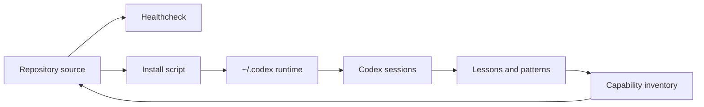

# Development Workspace Codex

Private, reproducible workspace for Manuel's Codex configuration, custom skills, and agentic workflow conventions.


## What This Repository Is

This repository is the source of truth for a reusable Codex development workspace:

- custom or adapted Codex skills;
- custom Codex subagents;
- global instruction templates;
- healthcheck and install scripts;
- operational docs for governance, self-improvement, and capability inventory.

The active runtime install is separate and lives under `~/.codex`.

## Contents

- `skills/`: custom or adapted Codex skills.
- `.codex/agents/`: custom Codex subagents.
- `codex-global/`: templates for global Codex instructions.
- `docs/decisions/`: short technical decisions explaining why the workspace is structured this way.
- `docs/capability-inventory.md`: source of truth for tracked skills, agents, status, risk, and overlap.
- `docs/runbooks/`: operational setup and validation procedures.
- `docs/lessons/` and `docs/patterns/`: operational memory for recurring fixes and reusable workflows.
- `scripts/`: Windows-first maintenance scripts.

## Quickstart Windows

```powershell
git clone https://github.com/manulazs/development-workspace-codex.git
cd development-workspace-codex
powershell -NoProfile -ExecutionPolicy Bypass -File scripts/healthcheck.ps1
powershell -NoProfile -ExecutionPolicy Bypass -File scripts/install-workspace.ps1 -WhatIf
powershell -NoProfile -ExecutionPolicy Bypass -File scripts/install-workspace.ps1
```

Restart Codex after installing or updating skills or agents.

Detailed steps: `docs/runbooks/setup-windows.md`.

## Quickstart macOS/Linux

```bash
git clone https://github.com/manulazs/development-workspace-codex.git
cd development-workspace-codex
chmod +x scripts/healthcheck.sh scripts/install-workspace.sh
scripts/healthcheck.sh
scripts/install-workspace.sh --dry-run
scripts/install-workspace.sh
```

Restart Codex after installing or updating skills or agents.

Detailed steps: `docs/runbooks/setup-macos.md`.

## Architecture



## Current Skills

The tracked skills are inventoried in `docs/capability-inventory.md`. Do not maintain a second manual list here; it will drift from `skills/`.

Current categories:

- Local governance and planning skills.
- dbt Labs analytics engineering skills.
- Adapted third-party UI/artifact/browser skills.
- Power BI and data visualization support skills.
- Communication and git-helper skills retained for explicit use cases.

## Current Custom Agents

The tracked custom agents are also inventoried in `docs/capability-inventory.md`.

- `agents_md_maintainer`: creates and maintains project `AGENTS.md` files.
- `dashboard_visualization_specialist`: supports dashboards, Power BI, DAX, HTML Content visuals, and analytical UI.
- `data_pipeline_engineer`: supports SQL, Databricks, dbt, joins, deduplication, validation, and analytics engineering.
- `data_science_modeler`: supports EDA, modeling, metrics, statistical validation, and reproducible analysis.
- `code_reviewer`: read-only reviewer that uses `codex review` when possible.
- `security_auditor`: security scan and threat-modeling specialist.
- `package_manager`: dependency, lockfile, version, and environment specialist.
- `local_skill_builder`: creates project-local skills for recurring workflows and asks before global promotion.
- `version_control_manager`: Git hygiene, commit, push, and repository state specialist.

## Governance

- Run `scripts/healthcheck.ps1` before and after workspace changes.
- Treat this repository as source of truth and `~/.codex` as runtime install.
- Keep subagent use controlled by `docs/subagents-policy.md`.
- Record recurring operational lessons in `docs/lessons/`.
- Promote stable workflows to `docs/patterns/` or `docs/runbooks/`.
- Record structural decisions in `docs/decisions/`.

## Repository Policy

This repository should remain private. It may contain workflow preferences and local environment conventions, but it must not contain credentials, tokens, logs, private data exports, or Codex internal state files.
