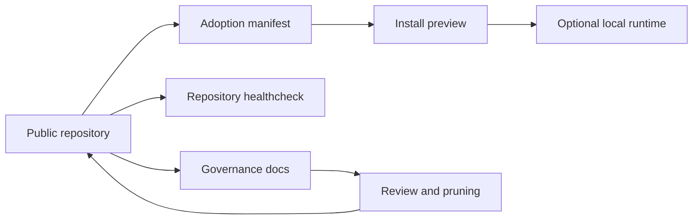

# Development Workspace Codex

Public, portable Codex workspace framework for governed skills, subagent templates, operational documentation, validation, and continuous improvement.


## What This Is

This repository is a reusable template for teams or individuals who want a governed Codex-assisted development workspace.

It is not a copy of any user's local Codex runtime. It does not try to mirror `~/.codex`, validate a maintainer's private machine, or treat absence of local installation as a repository failure.

The repository contains:

- reusable Codex skill sources under `skills/`;
- reusable custom subagent templates under `.codex/agents/`;
- global instruction templates under `codex-global/`;
- adoption profiles in `workspace-manifest.json`;
- healthcheck and profile-based installation helpers under `scripts/`;
- governance, setup, lifecycle, and audit documentation under `docs/`.

## Architecture

| Layer | Responsibility |
| --- | --- |
| Public repository | Versioned template, policies, reusable capabilities, validation |
| Consumer workspace | Project that chooses which profile or files to adopt |
| Local runtime | Private user state such as `~/.codex`, outside repository control |



## Start Here

- `docs/README.md`: documentation index.
- `workspace-manifest.json`: reusable adoption profiles.
- `docs/capability-inventory.md`: status, risk, overlap, and usage guidance for skills and agents.
- `docs/skills-provenance.md`: informational source, license, attribution, and risk notes for skills.
- `docs/agentic-controls.md`: control boundaries for recommending, spawning, creating, and persisting skills or subagents.
- `docs/continuous-evolution.md`: governed automation model for task cataloging, anti-duplication, subagent routing, validation, and human gates.
- `docs/subagents-policy.md`: when to use 0, 1, or multiple subagents.
- `docs/subagent-context-protocol.md`: context budgets, return budgets, and compact handoffs for efficient subagent use.
- `docs/self-improvement-lifecycle.md`: how lessons become reusable policies, skills, agents, or docs.
- `docs/runbooks/setup-windows.md`: Windows setup.
- `docs/runbooks/setup-macos.md`: macOS/Linux setup.

## Adopt In 10 Minutes

Evaluate the template without touching a local Codex runtime:

```bash
git clone https://github.com/manulazs/development-workspace-codex.git
cd development-workspace-codex
scripts/healthcheck.sh --strict
python scripts/evolve-workspace.py --strict
python scripts/scaffold-capability.py skill --name example-skill --purpose "Reusable example workflow." --mode proposal --dry-run
scripts/install-workspace.sh --list-profiles
scripts/install-workspace.sh --profile governed-codex --dry-run
```

On Windows, use the matching PowerShell commands from `docs/runbooks/setup-windows.md`.

Only copy capabilities into a runtime after choosing a profile explicitly. The maintainer's local `~/.codex` may contain extra review or curated capabilities and is not the public baseline.

## Adoption Profiles

Profiles describe what a consumer workspace may copy. They do not describe what is installed on this machine.

- `minimal`: docs, policies, templates, and repo validation only.
- `governed-codex`: core planning, audit, migration, `caveman lite` communication, and review governance capabilities.
- `data-bi`: data discovery, engineering, cataloging, science, analysis, BI, and visualization capabilities.
- `frontend-artifacts`: frontend and local artifact validation capabilities.
- `full-reviewed`: all core and optional capabilities approved for broad use.

Capabilities marked `curated`, `review`, `deprecated`, or `archived` are never installed by default profiles.

`caveman lite` is the mandatory communication standard for this repository and its exported global template. It means concise, direct, no filler, professional, and technically precise. Temporarily use fuller prose when safety, destructive operations, legal clarity, or complex instructions require it.

## Caveman LITE Activation Model

The upstream Caveman Codex install path is per-session: installing the `caveman` skill makes `/caveman` available, but Codex users still need to activate it during a session unless a higher-level instruction file says otherwise. This workspace intentionally keeps the upstream `skills/caveman/SKILL.md` behavior intact and makes LITE mandatory through `AGENTS.md` policy.

For a consumer runtime, both parts must be present:

- `skills/caveman/SKILL.md` under the selected Codex home;
- `AGENTS.md` copied from `codex-global/AGENTS.md`, adapted if needed, requiring `caveman lite`.

Preview a runtime adoption that includes the global instruction template:

```bash
scripts/install-workspace.sh --profile governed-codex --install-global-instructions --dry-run
```

```powershell
powershell -NoProfile -ExecutionPolicy Bypass -File scripts/install-workspace.ps1 -Profile governed-codex -InstallGlobalInstructions -WhatIf
```

Validate the repository contract:

```bash
python scripts/validate-caveman-lite.py --repo .
```

Validate an active local runtime explicitly:

```bash
python scripts/validate-caveman-lite.py --repo . --codex-home ~/.codex
```

## Validate The Repository

Windows:

```powershell
powershell -NoProfile -ExecutionPolicy Bypass -File scripts/healthcheck.ps1
```

macOS/Linux:

```bash
chmod +x scripts/healthcheck.sh scripts/install-workspace.sh
scripts/healthcheck.sh --strict
python scripts/validate-skills.py --strict
```

The healthcheck validates the repository itself: structure, docs, manifest coverage, skill frontmatter, provenance coverage, agent TOML, installer safety, basic secret patterns, bytecode-free Python syntax, and expected validators. It intentionally does not compare against `~/.codex`.

## Optional Runtime Adoption

Preview before copying anything:

```powershell
powershell -NoProfile -ExecutionPolicy Bypass -File scripts/install-workspace.ps1 -Profile governed-codex -WhatIf
```

```bash
scripts/install-workspace.sh --profile governed-codex --dry-run
```

List profiles:

```powershell
powershell -NoProfile -ExecutionPolicy Bypass -File scripts/install-workspace.ps1 -ListProfiles
```

```bash
scripts/install-workspace.sh --list-profiles
```

The installer copies only the selected profile into the chosen Codex home. It never deletes local runtime files, skips existing runtime files by default, and never installs `curated`, `review`, `deprecated`, or `archived` capabilities automatically. Use `--force` or `-Force` only after reviewing a dry-run or `-WhatIf` preview.

## Governance

- Keep `workspace-manifest.json` and `docs/capability-inventory.md` aligned with real files.
- Keep `docs/skills-provenance.md` aligned with skill source, license, attribution, and script-risk notes. Provenance is informational and does not block authorized repository skills.
- Add or materially change a skill only after checking whether an existing skill, agent, runbook, or policy already solves the problem.
- Add or materially change a subagent only when delegation improves quality or risk control and the scope is independent.
- Use `docs/agentic-controls.md` to distinguish recommending a capability from spawning, creating, persisting, or installing it.
- Use `docs/subagent-context-protocol.md` to keep subagent context packages and returns compact.
- Use `docs/continuous-evolution.md` and `scripts/evolve-workspace.py` to catalog improvement work before creating or changing skills and agents.
- Keep global communication-style preferences explicit in `codex-global/AGENTS.md`; do not hide personal tone preferences inside unrelated skills or agents.
- Record structural decisions in `docs/decisions/`.
- Capture recurring lessons in `docs/lessons/`, promote reusable workflows to `docs/patterns/` or `docs/runbooks/`, and prune obsolete content.
- Treat self-improvement as a governed review loop, not autonomous mutation.
- Do not commit secrets, private logs, local runtime state, cache files, sessions, auth files, or corporate data.

## Public Repository Policy

This repository is prepared for public reuse under Apache-2.0. Any consumer workspace may fork it, remove irrelevant capabilities, add local policies, and choose an adoption profile. Local runtime synchronization is always an optional consumer operation, not a repository health requirement.

Before claiming a fork is fully public-ready, run both platform healthchecks, review provenance notes for bundled sources and licenses, and verify that default profiles do not install `curated`, `review`, `deprecated`, or `archived` capabilities.
