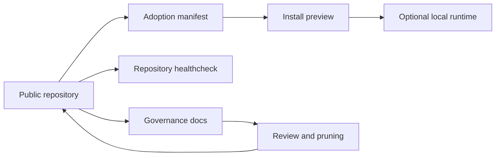

# Development Workspace Codex

Public, portable Codex workspace framework for governed skills, subagent templates, operational documentation, validation, and continuous improvement.


## What This Is

This repository is a reusable template for teams or individuals who want a governed Codex-assisted development workspace.

It is not a copy of any user's local Codex runtime. It does not try to mirror `~/.codex`, validate a maintainer's private machine, or treat absence of local installation as a repository failure.

The repository contains:

- reusable Codex skill sources under `skills/`;
- reusable custom subagent templates under `.codex/agents/`;
- global instruction templates under `codex-global/`;
- adoption profiles in `workspace-manifest.json`;
- healthcheck and profile-based installation helpers under `scripts/`;
- governance, setup, lifecycle, and audit documentation under `docs/`.

## Architecture

| Layer | Responsibility |
| --- | --- |
| Public repository | Versioned template, policies, reusable capabilities, validation |
| Consumer workspace | Project that chooses which profile or files to adopt |
| Local runtime | Private user state such as `~/.codex`, outside repository control |



## Start Here

- `docs/README.md`: documentation index.
- `workspace-manifest.json`: reusable adoption profiles.
- `docs/capability-inventory.md`: status, risk, overlap, and usage guidance for skills and agents.
- `docs/subagents-policy.md`: when to use 0, 1, or multiple subagents.
- `docs/self-improvement-lifecycle.md`: how lessons become reusable policies, skills, agents, or docs.
- `docs/runbooks/setup-windows.md`: Windows setup.
- `docs/runbooks/setup-macos.md`: macOS/Linux setup.

## Adoption Profiles

Profiles describe what a consumer workspace may copy. They do not describe what is installed on this machine.

- `minimal`: docs, policies, templates, and repo validation only.
- `governed-codex`: core planning, audit, migration, and review governance capabilities.
- `data-bi`: analytics engineering, dbt, BI, and data-focused capabilities.
- `frontend-artifacts`: frontend and local artifact validation capabilities.
- `full-reviewed`: all core and optional capabilities approved for broad use.

Capabilities marked `curated`, `review`, `deprecated`, or `archived` are never installed by default profiles.

## Validate The Repository

Windows:

```powershell
powershell -NoProfile -ExecutionPolicy Bypass -File scripts/healthcheck.ps1
```

macOS/Linux:

```bash
chmod +x scripts/healthcheck.sh scripts/install-workspace.sh
scripts/healthcheck.sh
```

The healthcheck validates the repository itself: structure, docs, manifest coverage, skill frontmatter, agent TOML, installer safety, basic secret patterns, and expected validators. It intentionally does not compare against `~/.codex`.

## Optional Runtime Adoption

Preview before copying anything:

```powershell
powershell -NoProfile -ExecutionPolicy Bypass -File scripts/install-workspace.ps1 -Profile governed-codex -WhatIf
```

```bash
scripts/install-workspace.sh --profile governed-codex --dry-run
```

List profiles:

```powershell
powershell -NoProfile -ExecutionPolicy Bypass -File scripts/install-workspace.ps1 -ListProfiles
```

```bash
scripts/install-workspace.sh --list-profiles
```

The installer copies only the selected profile into the chosen Codex home. It never deletes local runtime files and never installs `curated`, `review`, `deprecated`, or `archived` capabilities automatically.

## Governance

- Keep `workspace-manifest.json` and `docs/capability-inventory.md` aligned with real files.
- Add or materially change a skill only after checking whether an existing skill, agent, runbook, or policy already solves the problem.
- Add or materially change a subagent only when delegation improves quality or risk control and the scope is independent.
- Record structural decisions in `docs/decisions/`.
- Capture recurring lessons in `docs/lessons/`, promote reusable workflows to `docs/patterns/` or `docs/runbooks/`, and prune obsolete content.
- Do not commit secrets, private logs, local runtime state, cache files, sessions, auth files, or corporate data.

## Public Repository Policy

This repository is prepared for public reuse under Apache-2.0. Any consumer workspace may fork it, remove irrelevant capabilities, add local policies, and choose an adoption profile. Local runtime synchronization is always an optional consumer operation, not a repository health requirement.
