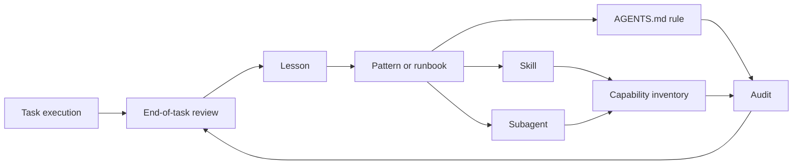

# Self-Improvement Lifecycle

This workspace should improve from evidence, not from one-off preferences. Use this lifecycle to decide what to record, promote, reject, or retire.

## Flow

## Record A Lesson

Create or update `docs/lessons/YYYY-MM.md` when:

- An error recurs or is likely to recur.
- A fix is validated with concrete evidence.
- A workflow fails due to environment, permissions, dependency, or tooling drift.
- A hidden assumption creates rework.

A lesson must include context, symptom, cause, validated fix, evidence, reuse rule, risk, and date.

## Promote A Lesson To A Pattern

Promote a lesson to `docs/patterns/` when:

- It has been useful more than once.
- It describes a reusable workflow or decision sequence.
- It is not tied to one project artifact.
- It can be followed without re-reading a full task transcript.

Use `docs/runbooks/` instead of `docs/patterns/` when the output is an operational procedure with commands and troubleshooting steps.

## Promote A Pattern To A Skill

Create or update a skill when:

- The pattern is invoked by task context or file type.
- The workflow needs reusable instructions, scripts, examples, or references.
- The behavior is specialized enough that keeping it only in `AGENTS.md` would make the global instructions noisy.
- The capability is not already covered better by a system skill, plugin, or existing local skill.

Every skill change must update `docs/capability-inventory.md` and pass repository validation.

## Promote A Pattern To A Subagent

Create or update a subagent when:

- The recurring responsibility is a role, not just instructions.
- It needs independent ownership, permission posture, or reviewable output.
- It can run in parallel with the orchestrator or another independent workstream.
- The role does not duplicate an existing agent.

Follow `docs/subagents-lifecycle.md`.

## Update AGENTS.md

Update `AGENTS.md` or `codex-global/AGENTS.md` only when:

- The rule is permanent, short, and broadly applicable.
- It changes future agent behavior.
- It is supported by repeated evidence or an explicit user decision.

Do not place long procedures, one-off preferences, or project-specific details in global instructions.

## Create An ADR

Create an ADR under `docs/decisions/` when:

- A structural decision changes repository architecture, governance, security posture, installation strategy, or capability lifecycle.
- The decision has credible alternatives.
- Future maintainers need to know why the choice was made.

Use lessons for operational fixes and ADRs for structural decisions.

## Register Rejected Patterns

Use `docs/patterns/rejected/` when:

- A tempting workflow was evaluated and rejected.
- A previous pattern was retired because it caused risk or duplication.
- A workaround should not be revived without new evidence.

Rejected patterns should include the reason, replacement, risk, and review date.

## Update Inventory

Update `docs/capability-inventory.md` whenever a skill or agent is:

- Added.
- Removed.
- Archived.
- Renamed.
- Reclassified.
- Given a new risk, overlap, or retention decision.

## Register An Audit

Create an audit under `docs/audits/`:

- After significant governance or installation changes.
- Before publishing a new reusable baseline.
- Monthly for lightweight health review.
- Quarterly for capability inventory review.

An audit should state scope, validations run, findings, risks, decisions, and follow-up actions.

## End-Of-Task Checklist

Before finalizing substantial workspace work, answer:

- Did this reveal a recurring error or validated fix?
- Did this create or reject a repeatable workflow?
- Did this change a structural decision?
- Did this add, remove, or reclassify a skill or agent?
- Did this require a runbook update?
- Did this require an inventory update?
- Did this require an audit entry?
