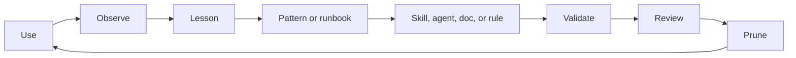

# Self-Improvement Lifecycle

This public workspace template should improve from repeated evidence, not from one-off preferences. Improvement must reduce future ambiguity, rework, or operational risk without accumulating dead documentation.

This lifecycle is not unbounded self-mutation. It is a governed review loop that an agent or maintainer follows when evidence justifies a reusable change. `docs/continuous-evolution.md` defines which parts may be automated and which parts remain human-gated.

## Flow

```text
use -> observe -> lesson -> pattern -> skill/agent/doc -> validate -> review -> prune
```



## Capture A Lesson

Create or update `docs/lessons/YYYY-MM.md` when:

- an error recurs or is likely to recur;
- a fix is validated with concrete evidence;
- a workflow fails due to environment, permissions, dependency, or tooling drift;
- a hidden assumption creates rework;
- the lesson is reusable by another consumer workspace.

A lesson must include context, symptom, cause, validated fix, evidence, reuse rule, risk, and date.

Do not record private local runtime state as public policy.

## Promote A Lesson To A Pattern Or Runbook

Promote a lesson to `docs/patterns/` when:

- it has been useful more than once;
- it describes a reusable workflow or decision sequence;
- it can be followed without reading a task transcript;
- it is not tied to one private machine or one private project artifact.

Use `docs/runbooks/` when the output is an operational procedure with commands, validation, and troubleshooting.

## Promote A Pattern To A Skill

Create or update a skill when:

- the pattern is invoked by task context, tool, file type, or domain;
- the workflow needs reusable instructions, scripts, examples, or references;
- the behavior is specialized enough that placing it in `AGENTS.md` would make global instructions noisy;
- the capability is not already covered better by a system skill, plugin, existing skill, runbook, or main-agent workflow.

Every skill change must update `workspace-manifest.json`, update `docs/capability-inventory.md`, and pass repository validation.

## Promote A Pattern To A Subagent

Create or update a subagent when:

- the recurring responsibility is a role, not just instructions;
- it needs independent ownership, permission posture, or reviewable output;
- it can run independently from the main thread;
- delegation improves quality or risk coverage enough to justify integration cost;
- the role does not duplicate an existing agent.

Follow `docs/subagents-lifecycle.md`.

## Update Instructions

Update repository `AGENTS.md` or `codex-global/AGENTS.md` only when:

- the rule is permanent, short, broadly applicable, and public;
- it changes future agent behavior;
- it is supported by repeated evidence or an explicit structural decision.

Do not place long procedures, one-off preferences, local runtime facts, or project-private details in global instructions.

## Create An ADR

Create an ADR under `docs/decisions/` when:

- a structural decision changes repository architecture, governance, security posture, installation strategy, or capability lifecycle;
- there are credible alternatives;
- future maintainers need to know why the choice was made.

Use lessons for operational fixes and ADRs for structural decisions.

## Register Rejected Patterns

Use `docs/patterns/rejected/` when:

- a tempting workflow was evaluated and rejected;
- a previous pattern was retired because it caused risk or duplication;
- a workaround should not be revived without new evidence.

Rejected patterns should include reason, replacement, risk, and review date.

## Update Inventory And Manifest

Update `workspace-manifest.json` and `docs/capability-inventory.md` whenever a skill or agent is:

- added;
- removed;
- archived;
- renamed;
- reclassified;
- given a new risk, overlap, adoption profile, or retention decision.

The manifest controls machine-readable profile behavior. The inventory explains human governance.

## Audit And Prune

Create an audit under `docs/audits/`:

- after significant governance or installation changes;
- before publishing a new reusable baseline;
- monthly for lightweight health review when the repo is active;
- quarterly for capability inventory review.

An audit should state scope, validations run, findings, risks, decisions, and follow-up actions. Historical audits must clearly say whether they are current, superseded, or actioned.

Use these status labels consistently:

- `current and open`: active findings or follow-ups remain.
- `current and actioned`: the audit is current and all required actions are complete.
- `historical`: retained as evidence but not current policy.
- `superseded`: replaced by newer policy or implementation.

Pruning is mandatory. A review that only adds content without removing or reclassifying stale content is incomplete.

## End-Of-Task Checklist

Before finalizing substantial workspace work, answer:

- Did this reveal a recurring error or validated fix?
- Did this create or reject a repeatable workflow?
- Did this change a structural decision?
- Did this add, remove, or reclassify a skill or agent?
- Did this require manifest or inventory updates?
- Did this require a runbook update?
- Did this require an audit entry?
- Did this identify content that should be pruned?
